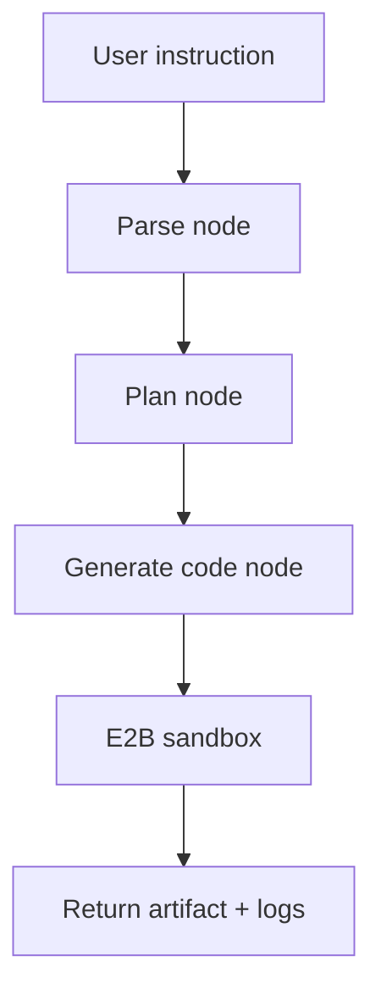

# Agent Architecture

## Flow
- Parse: prompt -> normalized ETL spec (input, columns, filters, output).
- Plan: short, deterministic steps describing the upcoming Polars work.
- Code: build a reproducible Polars script from the spec.
- Execute: run inside an isolated E2B sandbox, collect stdout/stderr/artifact.
- Respond: CLI surfaces plan, code, logs, and writes the artifact locally when available.

## Tools
- `parse_etl_instruction`: heuristic extraction of paths/columns/filters before the LLM normalizes.
- `generate_polars_code`: deterministic Polars script generator with select/filter/limit + smart writers.
- `execute_in_e2b`: provisions a sandbox, installs Polars, runs the script, and returns outputs/artifacts.
